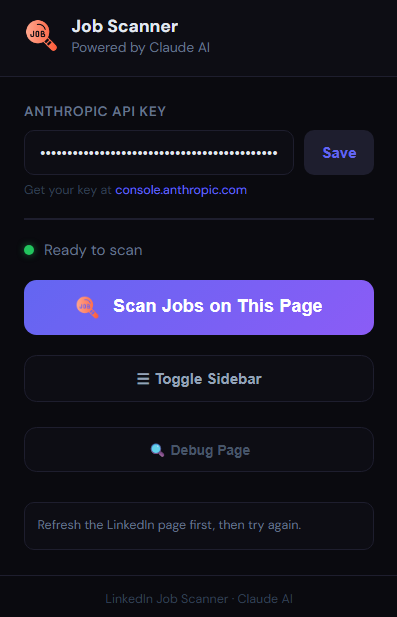
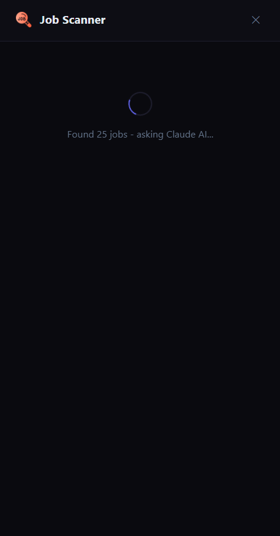
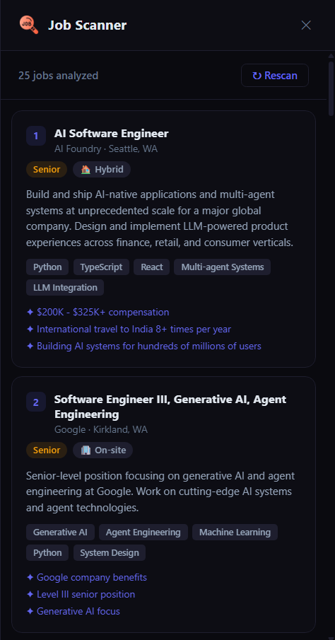

#  LinkedIn Job Scanner - Chrome Extension

Scan and summarize LinkedIn job listings in bulk using Claude AI. No more clicking into each job one by one!

<table>
  <tr>
    <td><b>Popup</b></td>
    <td><b>Sidebar - Scanning</b></td>
    <td><b>Sidebar - Results</b></td>
  </tr>
  <tr>
    <td width="33%" valign="top"></td>
    <td width="33%" valign="top"></td>
    <td width="33%" valign="top"></td>
  </tr>
</table>

---

## 🚀 Installation (Chrome)

1. **Download & unzip** this folder somewhere on your computer
2. Open Chrome and go to `chrome://extensions`
3. Enable **Developer Mode** (top-right toggle)
4. Click **"Load unpacked"** → select the unzipped folder
5. The extension icon appears in your Chrome toolbar

---

## 🔑 Setup

1. Click the extension icon in your toolbar
2. Enter your **Anthropic API key** (get one at https://console.anthropic.com)
3. Click **Save**

---

## 📖 How to Use

1. Go to `https://www.linkedin.com/jobs/`
2. Search for any role (e.g. "Software Engineer")
3. Wait for the job list to fully load on the left panel
4. Click the extension icon
5. Click **"Scan Jobs on This Page"**
6. The sidebar slides in with AI summaries of all visible jobs!

### What you get for each job:

- 📝 2-sentence AI summary
- 🏷️ Seniority level (Junior / Mid / Senior / Lead / Principal)
- 🌐 Job type (Remote / Hybrid / On-site)
- 🔧 Top required skills
- ✦ Key highlights

---

## 🏗️ How It Works

### Architecture

```
LinkedIn Page (content.js)
    → scrapes job cards from DOM
    → sends to Background Service Worker (background.js)
        → calls Anthropic Claude API in batches of 5
        → returns structured JSON analysis
    → renders results in sidebar
```

### Why Background Service Worker?

LinkedIn's Content Security Policy (CSP) blocks direct API calls from the page. The background service worker runs outside LinkedIn's CSP, so it can call the Anthropic API freely.

### How Jobs Are Scraped

LinkedIn uses **randomized/hashed CSS class names** (e.g. `_382b8834`, `e71dae0a`) that change with every deployment. We cannot rely on these.

Instead we anchor on **two stable classes** discovered by live DOM inspection (May 2026):

| Selector                       | What it finds                                                                |
| ------------------------------ | ---------------------------------------------------------------------------- |
| `span._794ff500`               | Every job title on the page (every 2nd one - odd are aria-hidden duplicates) |
| `.closest('div._2f9e3fe1')`    | The title's immediate wrapper div                                            |
| `.parentElement.parentElement` | The full job card container                                                  |

Each job card's text lines are structured as:

```
Line 0: "Selected, Job Title" (if currently selected) or "Job Title"
Line 1: "Job Title" (repeated)
Line 2: Company Name
Line 3: Location (e.g. "Seattle, WA (Hybrid)")
```

The job description is found by:

```javascript
Array.from(document.querySelectorAll("div")).find((d) =>
  d.innerText?.trim().startsWith("About the job"),
);
```

This is stable - LinkedIn always uses "About the job" as the description header.

---

## 🔧 If It Breaks (LinkedIn Updated Their DOM)

LinkedIn deploys updates frequently and hashed class names will change. Here's how to find the new selectors in ~5 minutes:

### Step 1: Find the new title class

Open LinkedIn Jobs, search something, wait for results. Open DevTools Console (F12) and type:

```javascript
document.querySelectorAll("span._794ff500").length;
```

If it returns 0, the class has changed. Find the new one by right-clicking a job title → Inspect, then look for the `<span>` containing the title text and note its class.

### Step 2: Verify the card boundary

Once you have the new title class (replace `_794ff500`):

```javascript
let s = document.querySelectorAll("span._794ff500")[0];
let card = s.closest("div._2f9e3fe1").parentElement.parentElement;
console.log(card?.innerText?.slice(0, 200));
```

Should print: title, company, location. If not, adjust the number of `.parentElement` calls up or down.

### Step 3: Verify all cards

```javascript
Array.from(document.querySelectorAll("span._794ff500"))
  .filter((_, i) => i % 2 === 0)
  .map((s) => {
    let c = s.closest("div._2f9e3fe1")?.parentElement?.parentElement;
    let lines =
      c?.innerText
        .split("\n")
        .map((l) => l.trim())
        .filter(Boolean) || [];
    return {
      title: lines[0]?.replace(/^Selected,\s*/i, ""),
      company: lines[2],
      location: lines[3],
    };
  })
  .slice(0, 5)
  .forEach((j) => console.log(JSON.stringify(j)));
```

Should print 5 clean job objects. Once confirmed, update the selectors in `content.js`.

### Step 4: Update content.js

Replace `_794ff500` and `_2f9e3fe1` with the new class names at the top of `collectJobs()`.

---

## 🔮 What's Next...

- Copy raw extraction without LLM calls
- Resume matching & scoring
- Auto-scan as you scroll (load more jobs)
- Click a job card in sidebar to jump to it on LinkedIn
- Export results to CSV / spreadsheet
- Support for other job sites (Indeed, Glassdoor)

---

## ⚠️ Notes

- Your API key is stored locally in Chrome only - never sent anywhere except Anthropic's API
- This extension reads what's visible on your screen - no credentials are stored or misused
- Use for personal job searching only - respect LinkedIn's Terms of Service

## 🙏 Credits

Icon designed by [Abdul-Aziz](https://www.flaticon.com/free-icon/job-search_17215344) from [Flaticon](https://www.flaticon.com)
